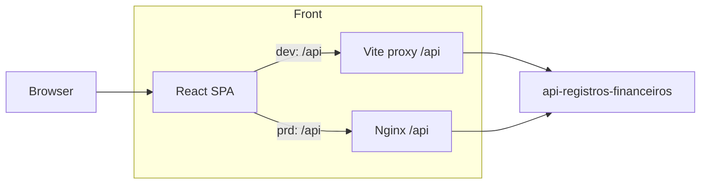
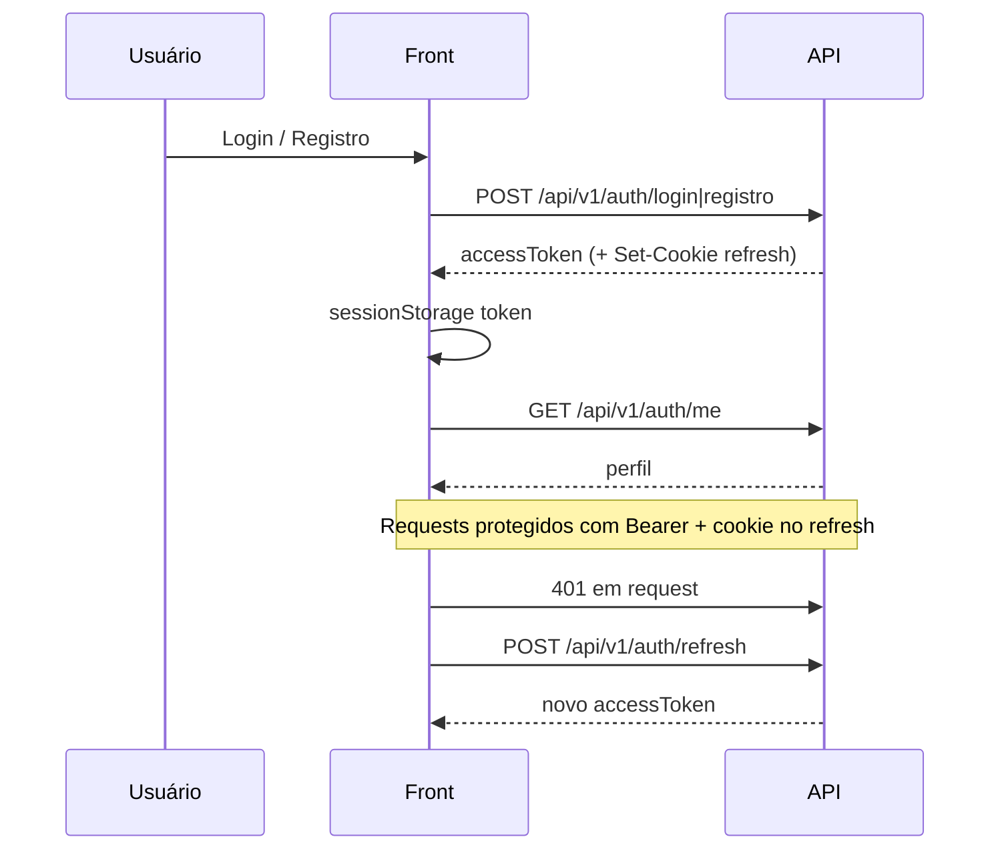

# Arquitetura — web-registros-financeiros

## Visão geral

SPA React que consome a API de registros financeiros via **same-origin** `/api/v1/...`. Em desenvolvimento o Vite faz proxy; em produção o Nginx faz proxy para o backend.

## Camadas (`src/`)

| Pasta | Papel |
|-------|--------|
| `api/` | `fetch` central (`client.ts`) + funções por recurso |
| `context/` | `AuthProvider`, `CompetenciaProvider` |
| `components/auth` | `ProtectedRoute` |
| `components/layout` | Shell, sidebar, header |
| `components/ui` | Design system local |
| `pages/` | Telas por rota |
| `types/`, `utils/`, `hooks/` | Tipagem e helpers |

Entry: `src/main.tsx` → providers → `App` (rotas).

## Chamadas à API

Arquivo: `src/api/client.ts`

- Paths relativos: `/api/v1/...` (sem base URL no front hoje)
- `credentials: 'include'` — permite cookie de refresh nas rotas de auth
- Header `Authorization: Bearer <accessToken>` quando autenticado
- Header `X-Ambiente-Id` a partir de `sessionStorage`
- Em **401**: tenta `POST /api/v1/auth/refresh` e refaz a request uma vez

Não há uso atual de `import.meta.env` / `VITE_*`.

## Autenticação (UX)

| Item | Onde fica |
|------|-----------|
| Access token | Memória + `sessionStorage` |
| Refresh token | Cookie HttpOnly (gerenciado pela API; path `/api/v1/auth`) |
| Ambiente ativo | `sessionStorage` → header `X-Ambiente-Id` |

Rotas protegidas usam `ProtectedRoute`: sem usuário → redirect `/login`.

## Proxy

### Desenvolvimento (`vite.config.ts`)

- Porta: **5174**
- `proxy['/api']` → `http://localhost:8090`

### Produção (`nginx.conf` / Docker)

- Container escuta **8080**
- Static files do build Vite
- `location /api/` → proxy para o backend HTTPS
- SPA: `try_files` → `index.html`
- Cookies repassados; `Origin` pode ser esvaziado no proxy para evitar CORS

Use [`nginx.conf.example`](../nginx.conf.example) como referência pública. Configure o hostname do backend no ambiente de deploy — **não** publique secrets nem URLs internas privadas na documentação.

### Dockerfile

Multi-stage:

1. `node:22-alpine` — `npm install` + `npm run build`
2. `nginx:1.27-alpine` — copia `dist` + `nginx.conf`, `EXPOSE 8080`

## Segurança para repositório público

- Não commitar `.env` / tokens / dados reais de usuários
- Evitar colar cookies JWT em issues
- Revisar `nginx.conf` antes de tornar o repo público: hostnames de deploy podem ser específicos do ambiente
- O front não embute API keys; a proteção fica na API (JWT, CORS, rate limit)

## Projetos relacionados

- Backend: `api-registros-financeiros` (documentação de endpoints naquele repo)
- E-mails: `api-envio-emails` (convites)

## Features / telas

Ver [features.md](./features.md).
