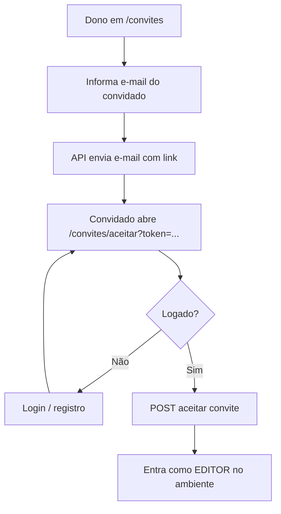

# Features e rotas — web-registros-financeiros

## Mapa de rotas

| Path | Auth | Tela |
|------|------|------|
| `/login` | Público | Login (e-mail ou telefone + senha) |
| `/registro` | Público | Cadastro de usuário |
| `/convites/aceitar` | Público* | Aceitar convite (`?token=`); exige login para concluir |
| `/` | Protegido | Redirect → `/despesas` |
| `/despesas` | Protegido | Despesas da competência |
| `/receitas` | Protegido | Receitas da competência |
| `/categorias` | Protegido | Categorias do ambiente |
| `/pagadores` | Protegido | Pagadores do ambiente |
| `/convites` | Protegido | Convidar editores + membros |

\* A página é acessível sem auth, mas o aceite chama a API autenticada.

## Fluxos principais

### Cadastro e login

1. `/registro` — nome, sobrenome, telefone (10–11 dígitos), e-mail, senha (≥ 8)
2. Após sucesso, o app faz login automático
3. `/login` — campo `login` aceita e-mail ou telefone
4. Redirect pós-login: `returnUrl` seguro ou `/despesas`

### Competência (mês/ano)

Contexto global (`CompetenciaProvider`). O seletor aparece no header das páginas de **despesas** e **receitas**. Listagens pedem `ano` e `mes` à API.

### Ambientes

Não há tela CRUD de ambientes. O app:

- Lista ambientes / membros via API
- Guarda o ambiente ativo em `sessionStorage`
- Envia `X-Ambiente-Id` nas requests
- Na página de **Convites**, o dono gerencia convites e vê membros/papéis (`DONO` / `EDITOR`)

### Despesas

- Listagem filtrável por competência
- Cadastro/edição: descrição, valor, vencimento, categoria, tipo (`UNICA` / `FIXO` / `VARIAVEL`), parcelas (variável), escopo, responsável, pago
- Toggle de pagamento e exclusão

### Receitas

- Listagem por competência com totais
- Cadastro/edição: pagador, valor, data, responsável, pago
- Toggle de pagamento e exclusão

### Categorias e pagadores

- Cadastro (descrição curta), listagem e exclusão
- Exclusão pode falhar na API se houver vínculos (despesas/receitas)

### Convites

Tag usada pelo backend: `CONVITE_EDICAO_DESPESAS` (detalhes na API / serviço de e-mail).

## Integração HTTP (resumo)

Todos os módulos usam o client em `src/api/`:

| Módulo front | Prefixo API (conceitual) |
|--------------|---------------------------|
| Auth | `/api/v1/auth` |
| Ambientes | `/api/v1/ambientes` |
| Despesas | `/api/v1/despesas` |
| Receitas | `/api/v1/receitas` |
| Categorias | `/api/v1/categorias` |
| Pagadores | `/api/v1/pagadores` |
| Convites | `/api/v1/convites` |

Contratos de request/response: documentação do repositório `api-registros-financeiros` (`docs/api.md`).

## UI

Componentes locais em `src/components/ui` (Button, Input, Modal, DataTable, etc.).  
Ver também [design-system.md](./design-system.md) se estiver presente no repositório.
